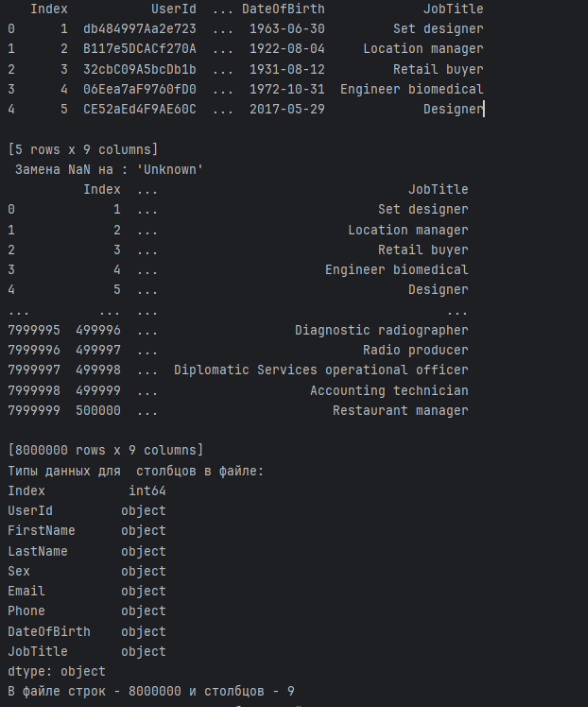
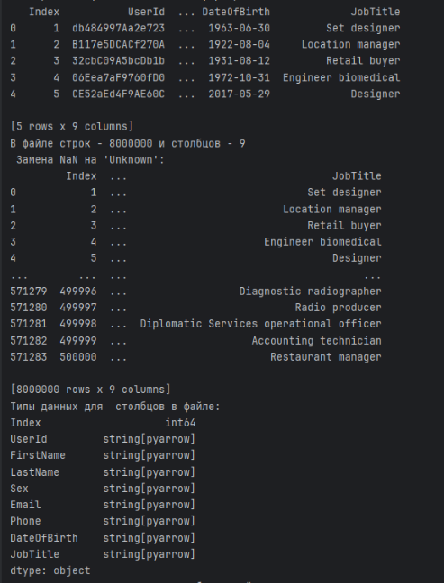
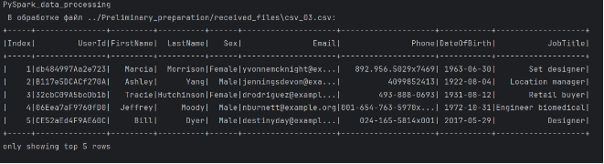
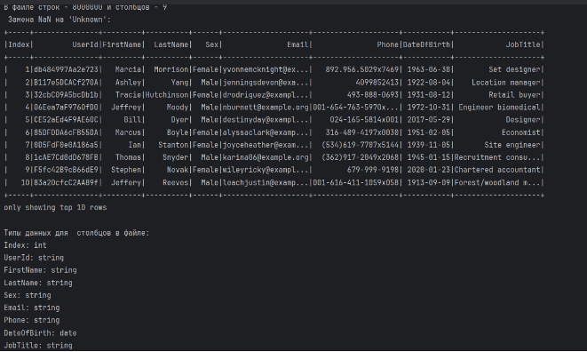
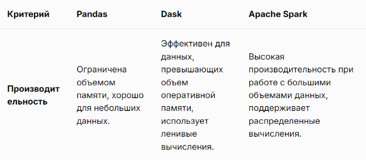
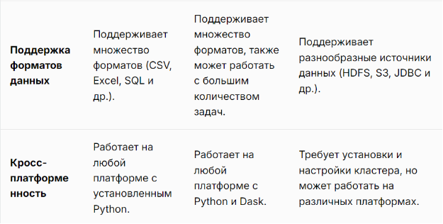
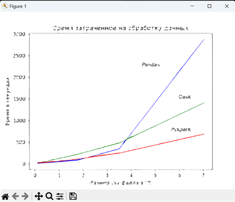

## Анализ и сравнение различных способов обработки и хранения больших данных: Pandas, Dask и Apache Spark:


В этом проекте предпринята попытка проанализировать и сравнить три различных способов обработки и хранения *больших данных* в Python: **Pandas**, **Dask** и **Apache Spark**. 
Каждая из этих библиотек имеет свои особенности и преимущества, которые делают их подходящими для различных способов обработки и хранения *больших данных*.

В данном README представлены краткие описания каждой библиотеки, их основные возможности и примеры использования.

## Содержание

1. [Описание](#описание)

2. [Технологии](#технологии)

3. [Установка библиотек](#установка-библиотек)

4. [Подготовка файлов для обработки больших данных](#подготовка-файлов-csv)

5. [Пример использования](#пример-использования)
- [1. Pandas](#1-Pandas)

- [2. Dask](#2-Dask)

- [3. Apache Spark](#3-Apache-Spark)

6. [Сравнение библиотек](#сравнение-библиотек)

7. [Заключение](#заключение)

## Описание

Целью этого проекта является анализ и сравнение методов обработки и хранения больших данных с использованием Pandas, Dask и Apache Spark; понимание ключевых отличий, оценка удобства работы с каждой библиотекой; оценка возможностей проведения обработки *больших данных*, рекомендации по использованию той или иной библиотеки в зависимости от различных характеристик используемых средств вычислительной техники

- **Pandas** — программная библиотека на языке Python для обработки и анализа данных; программным продуктом, предназначенным для статистической обработки.

- **Dask** — библиотека для параллельных вычислений на Python, которая позволяет обрабатывать большие данные, распределяя задачи по нескольким процессам и машинам.

- **Apache Spark** — это Фреймворк с открытым исходным кодом для реализации распределённой обработки данных, входящий в экосистему проектов *Hadoop*.

Для реализации приложений с использованием Pandas, Dask и Apache Spark была выбраны структуры Data frame, исходные файлы для обработки  - csv-файлы. Приложение Apache Spark реализовано с использованием Фреймворка Pyspark.

## Технологии

Проект использует следующие технологии:

- **Python**: Основной язык программирования.

- **Pandas**: Для подготовки csv-файлов, используемых в дальнейшем приложениями; проведения обработки csv-файлов большого размера.

- **Dask**: Для проведения обработки csv-файлов большого размера.

- **Pyspark**: Для проведения обработки csv-файлов большого размера.

- **Matplotlib**: библиотека для построения графика сравнения результатов обработки больших данных с использованием различных библиотек.

## Установка библиотек

Для того чтобы начать работать с данными библиотеками, их необходимо установить на свой компьютер, а для этого, скачайте библиотеки:

1. Для библиотеки Pandas:

  ```bash

    pip install pandas

```

2. Для библиотеки Dask:

````bash

   pip install dask[complete]

 ````

3. Для библиотеки Pyspark:

````bash

   pip install pyspark

````

! Предварительно необходимо проверить наличие установленной **JAVA 8**, библиотеки **Apache Spark** и задать необходимые значения для переменных среды ([Как установить Spark NLP на Windows, Ubuntu и в Google Colab](https://spark-school.ru/blog/spark-nlp-installation/))

4. Для библиотеки Matplotlib:

```bash

    pip install matplotlib

````

## Подготовка файлов csv

`	`Для сравнения результатов обработки больших данных различными способами
был написан небольшой скрипт(**Preparation_csv_files-pandas.py** в папке 
**Preliminary_preparations/received_files**), алгоритм которого следующим образом 
позволяет сформировать серию csv-файлов:

- исходный файл считывается в **DataFrame**;

- первый csv-файл для обработки получается многократным удвоением полученного **DataFrame**, вплоть до 800 Мб. Как только объем **DataFrame** достигает 800 Мб или превышает его, производится запись полученного **DataFrame** в *csv-файл*. Каждый последующий csv-файл получается посредством удвоения размера предыдущего. В результате получено 7 csv-файлов размером от 110 Мб до 7027 Мб.

## Пример использования

Примеры кода для анализа и сравнения различных способов обработки больших данных(**Pandas**, **Dask** и **Apache Spark**):

### 1 Pandas
 
**Pandas** — работает в памяти как локальный инструмент. Он работает на одном компьютере, и все данные загружаются в оперативную память.  Это делает его пригодным для небольших и средних наборов данных, которые могут уместиться в памяти (обычно до нескольких миллионов строк). Архитектура Pandas не предназначена для работы с данными, превышающими объём оперативной памяти, поэтому при больших объёмах данных могут возникнуть проблемы с производительностью и памятью.

**Официальная документация**: ([pandas documentation — pandas 2.2.3 documentation](https://pandas.pydata.org/docs/))

**Особенности**:

*	Простота использования и удобный API.

*	Высокая скорость благодаря оптимизации кода.

*	Интуитивно понятный интерфейс.

*	Широкие возможности для обработки и анализа данных.

*	Отличная поддержка табличных данных.

*	Расширенные возможности за счет интеграции с другими библиотеками на Python, в частности, с NumPy, Matplotlib и Scikit-learn.

Пример использования приложения для вывода “шапки” файла (первых 5 строк), замены пропущенных значений в строках на “Unknown” и вывода типов данных для столбцов(в папке **Pandas_task** файл **data_processing_pandas.py**)


```python

import pandas as pd
import glob
import shutil
import time

……..

# чтение файла по 10 000 000 строк, учитывая, что существует ограничение на объем свободного ОЗУ
 for i in pd.read_csv(csv_filename, sep=',', chunksize=10000000):
    if j == 0:
        columns = i.shape[1]
        # вывод на дисплей первых 5 строк сформированного дата фрейма
        print(f'{i.head()}')
        # замена пропущенных значений на "Unknown"
        print(f" Замена NaN на : 'Unknown'")
        i.fillna('Unknown', inplace=True)
        print(i)
        #  вывод на печать типов данных для столбцов в файле
        print(f'Типы данных для  столбцов в файле: ')
        print(i.dtypes)

```

Полученные результаты:



### 2 Dask

**Dask** — это библиотека для параллельных вычислений на Python, которая позволяет обрабатывать большие данные, распределяя задачи по нескольким процессам и машинам.

**Официальная документация**: ([Dask — Dask documentation](https://docs.dask.org/en/stable/))

**Особенности**:

*	Обеспечивает параллельное выполнение задач, используя несколько ядер на одной машине или распределённых по кластеру.

*	Может масштабироваться от одного ноутбука до большого кластера, что делает его подходящим как для небольшой, так и для крупномасштабной обработки данных.

*	Легко интегрируется с популярными библиотеками  **Python**, такими как **NumPy**, **pandas** и **cikit-learn**.

*	Предоставляет различные планировщики, включая однопоточные, многопоточные, многопроцессорные и распределённые планировщики, для удовлетворения различных вычислительных потребностей.

*	Легкость в использовании для пользователей **Pandas**, так как многие операции, такие как фильтрация, группировка и объединение, разработаны идентично.

*	Поддерживает форматы данных **CSV**, **Parquet* и **HDF5**, что позволяет легко интегрироваться с существующими хранилищами данных.

Пример использования приложения для вывода “шапки” файла (первых 5 строк), вывода количества строк и столбцов в датафрейме, замены пропущенных значений в строках на “Unknown” и вывода типов данных для столбцов(в папке **Dask_task** файл **data_processing_dask.py**):

```python

import dask.dataframe as dd
import glob
import shutil
import time

…….

for csv_filename in all_csv_filenames:
…..
    df = dd.read_csv(csv_filename)
    print(df.head())        # вывод на дисплей первых 5 строк сформированного дата фрейма
    # вывод кол-строк и столбцов в датафрейме
    print(f'В файле строк - {df.shape[0].compute(num_workers=8)} и столбцов - {df.shape[1]}')
    # замена пропущенных значений на "Unknown"
    print(f" Замена NaN на 'Unknown': ")
    print(df.fillna('Unknown').compute(num_workers=8))
    #  вывод на печать типов данных для столбцов в датафрейме
    print(f'Типы данных для  столбцов в файле: ')
    print(df.dtypes)

```

Полученные результаты:



### 3 Apache Spark

***Apache Spark*** — это Фреймворк с открытым исходным кодом для реализации распределённой обработки данных, входящий в экосистему проектов ***Hadoop***. ***Spark*** обрабатывает данные в оперативной памяти, что позволяет получать значительный выигрыш в скорости работы.

**Официальная документация**: ([Documentation | Apache Spark](https://spark.apache.org/documentation.html))

***Особенности***:

*	Предоставляет разработчику довольно обширный API, позволяя работать с разными языками программирования: **Python**, **R**, **Scala** и **Java**.

*	Широкие функциональные возможности за счет многокомпонентного состава в виде модулей Spark SQL, Spark Streaming, MLib.

*	“Ленивые” вычисления позволяют снизить общий объем вычислений и повысить производительность программы за счет снижений требований к памяти. Также можно проверить структуру конечного результата, не выполняя какие-либо промежуточные шаги.

*	Предусматривает распределенную обработку данных, включая концепцию ***RDD*** (resilient distributed dataset) – это распределенная структура данных, размещаемая в оперативной памяти. ***Spark*** сам раскидывает код по всем узлам кластера, разбивает его на подзадачи, создает план выполнения и отслеживает успешность выполнения.

*	Имеет в своем арсенале простой и интуитивно понятный способ поворота **Datafame**. Пользователю необходимо всего лишь выполнить операцию ***groupBy*** для столбцов с целевым индексом, поворачивая целевое поле для дальнейшего использования в качестве столбцов.

*	Для поддержки языка **Python** разработан **PySpark**, который предлагает модуль **Pyspark Shell**, связывающий **Python API** и контекст **Spark**. Возможно применение метода ***toPandas*** для преобразования **Spark DataFrame** в **Pandas**. ***PySpark*** расширяет функциональность языка **Python** до операций с массивными наборами данных, ускоряя цикл разработки.

Пример использования приложения для вывода “шапки” файла (первых 5 строк), вывода количества строк и столбцов в датафрейме, замены пропущенных значений в строках на “Unknown” и вывода типов данных для столбцов (в папке **Pyspark_task** файл **data_processing_pyspark.py**):

```python

from pyspark.sql import SparkSession
import glob
import shutil
import time

spark = SparkSession \
.builder \
.master("local[\*]") \
.config("spark.sql.debug.maxToStringFields", 1000) \
.config("spark.driver.memory", "4g") \
.config("spark.executor.memory", "4g") \
.appName('PySpark\_data\_processing') \
.getOrCreate()
………….
for csv_filename in all_csv_filenames:
………
    df = spark.read.csv(csv_filename, sep=',',
            inferSchema=True, header=True)
    print(df.show(5))       # вывод на дисплей первых 5 строк сформированного дата фрейма
    num_rows = df.count()
    num_cols = len(df.columns)
    # вывод кол-строк и столбцов в датафрейме
    print(f'В файле строк - {num_rows} и столбцов - {num_cols}')
    # замена пропущенных значений на "Unknown" и вывод 10 строк
    print(f" Замена NaN на 'Unknown': ")
    df.na.fill('Unknown').show(10)
    #  вывод на печать типов данных для столбцов в датафрейме
    print(f'Типы данных для  столбцов в файле: ')
    dtypes = df.dtypes
    for column, dtype in dtypes:
        print(f'{column}: {dtype}')
    del dtypes

```

Полученный результат:



## Сравнение библиотек


## Заключение
В результате работы приложений в папке **display_results** получены 3 файла: *dask.txt*, *pandas.txt* и *pyspark.txt*, содержащие информацию о длительности обработки каждого из 7 csv-файлов.

В этой же папке находится скрипт *print_results.py*, который выводит графики затраченного времени на обработку каждого файла всеми 3-мя приложениями. Указанный график выглядит так:



Каждое из трех приложений имеет свои сильные и слабые стороны и подходит для разных сценариев.

- **Pandas** является отличным выбором для анализа данных небольшого и среднего объема благодаря своей простоте и мощной функциональности.

- **Dask** хорошо подходит для случаев, когда объем данных превышает доступную память, предлагая API, схожий с Pandas, при этом улучшая производительность за счет ленивых вычислений.

- **Apache Spark** идеален для обработки очень больших объемов данных в распределенной среде, предлагая возможности параллелизма и обработки в реальном времени.

Выбор подходящего инструмента зависит от конкретных требований вашего проекта, объема данных и уровня необходимых вычислительных ресурсов.


